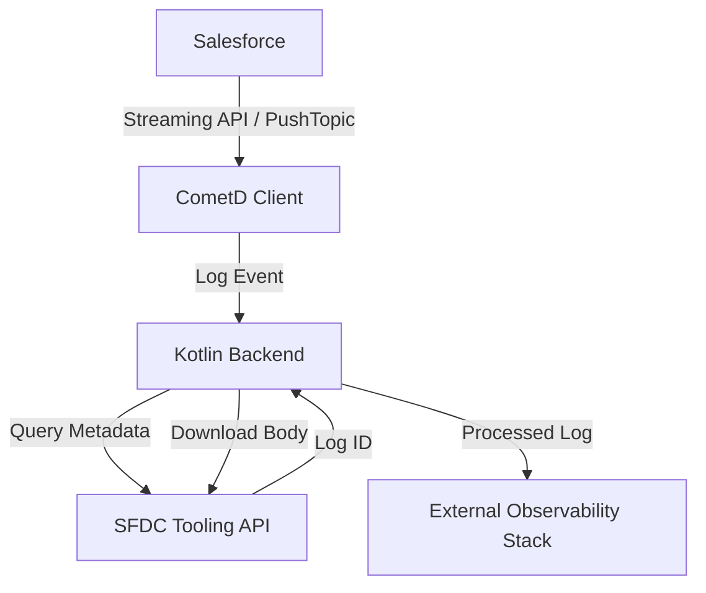

# Salesforce Observable Logging System

A real-time observability platform built with Kotlin and Spring Boot to centralize, monitor, and analyze Salesforce debug logs and system events.

## Project Goals

- **Centralized Visibility**: Aggregate logs from multiple Salesforce environments into a single backend service.
- **Real-time Monitoring**: Use Salesforce Streaming API (CometD) to react to log events the moment they are generated.
- **Deep Inspection**: Automatically fetch full `ApexLog` bodies using the Tooling API for detailed root-cause analysis.
- **Scalable Processing**: Provide a robust Kotlin-based foundation to filter, transform, and forward logs to external observability tools (e.g., ELK, Splunk, Datadog).

## Architecture Design

The system follows a reactive architecture to handle the asynchronous nature of Salesforce log generation.

### Visual Workflow
```text
+----------------+       Streaming API       +----------------+
|   Salesforce   | ------------------------> |  CometD Client |
| (TraceFlags &  |      (PushTopic)          | (Kotlin/Jetty) |
|  PushTopic)    |                           +-------+--------+
+-------^--------+                                   |
        |                                            | Log Event
        |            Tooling API / REST              v
        +------------------------------------ [ Kotlin Backend ]
               (Fetch Metadata & Body)               |
                                                     | Processed Log
                                                     v
                                             +----------------+
                                             |  Observability |
                                             |     Stack      |
                                             +----------------+
```

### Technical Flow (Mermaid)


### Components

1.  **Salesforce (Source)**:
    *   **TraceFlags**: Configured to capture logs for specific users/classes.
    *   **PushTopic**: Broadcasts notifications when new `ApexLog` or custom log records are created.
2.  **Kotlin Integration Service**:
    *   **CometD Client**: Maintains a long-polling connection to Salesforce Streaming API.
    *   **Log Processor**: Orchestrates the fetching of log bodies and performs initial parsing.
    *   **Tooling/REST Client**: Communicates with Salesforce APIs for metadata and log retrieval.
3.  **Observability Layer (Optional)**:
    *   The processed logs can be forwarded to tools like Elasticsearch, CloudWatch, or custom dashboards.

## Tech Stack

- **Language**: Kotlin 2.2.21
- **Framework**: Spring Boot 4.0.6
- **Communication**: 
    - CometD (Bayeux Protocol) for real-time events.
    - Salesforce Tooling & REST API for data retrieval.
- **Build Tool**: Maven

## Getting Started

1.  **Salesforce Setup**: Ensure you have a `PushTopic` created and `TraceFlags` active.
2.  **Configuration**: Update `src/main/resources/application.properties` with your Salesforce credentials and endpoint.
3.  **Reference**: See [SKILL.md](./SKILL.md) for detailed implementation snippets and API references.

---
*Maintained by the Observability Engineering Team.*
