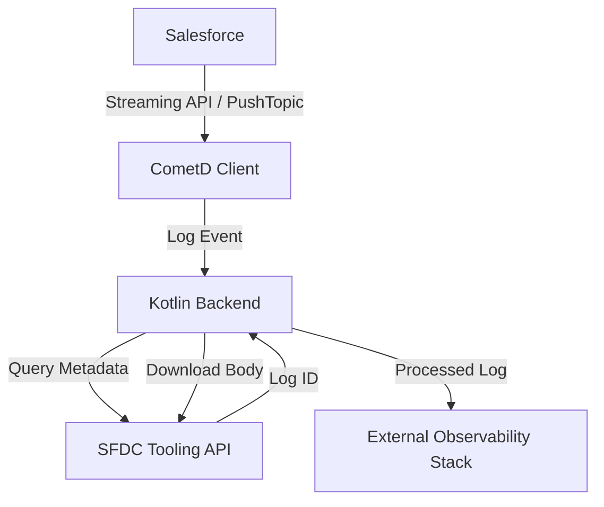

# Apexium.log

a Salesforce developer productivity tool designed to simplify Debug Log management, automate Trace Flag scheduling, monitor Apex code coverage, track metadata changes, and retain debugging history beyond Salesforce's native limitations. It helps developers spend less time managing logs and more time building reliable applications.

## Features

* 🚀 **Centralized Debug Log Management** to manage, search, download, and delete Salesforce Debug Logs from a single interface, making debugging more efficient.
* ⏰ **Automated Recurring Trace Flags** to automatically extend user trace sessions beyond Salesforce's 24-hour Trace Flag limitation.
* 📊 **Apex Code Coverage Reports** to view code coverage for all Apex Classes and Triggers in a centralized dashboard, helping ensure deployment readiness.
* 🔍 **Metadata Change Tracking** to detect and compare changes in Apex Classes and Triggers through metadata body comparison, making code changes easier to review.
* ♻️ **Reusable Debug Sessions** to quickly reuse previously configured Trace Flags and debugging settings without repeating manual configuration.
* 🗃️ **Extended Debug Log Retention** to retain Debug Logs for up to 30 days, even after they have expired or been removed from Salesforce.
* ⚡ **Faster Root Cause Analysis** by combining Debug Log history, metadata changes, and trace information in a single application for quicker issue investigation.
* 📈 **Improved Developer Productivity** by automating repetitive tasks such as Trace Flag scheduling, Debug Log cleanup, and code coverage monitoring.
* 🛡️ **Reduced Debug Log Storage Issues** through selective or bulk Debug Log cleanup, helping prevent Salesforce storage limit issues.
* 🎯 **Built for Salesforce Developers** who need an all-in-one solution for debugging, monitoring, and tracking Apex code changes.

## Architecture Design

The system follows a reactive architecture to handle the asynchronous nature of Salesforce log generation.

### Visual Workflow
```text
+----------------+       Streaming API       +----------------+
|   Salesforce   | ------------------------> |  CometD Client |
| (TraceFlags &  |      (PushTopic)          | (Kotlin/Jetty) |
|  PushTopic)    |                           +-------+--------+
+-------^--------+                                   |
        |                                            | Log Event
        |            Tooling API / REST              v
        +------------------------------------ [ Kotlin Backend ]
               (Fetch Metadata & Body)               |
                                                     | Processed Log
                                                     v
                                             +----------------+
                                             |  Observability |
                                             |     Stack      |
                                             +----------------+
```

### Technical Flow (Mermaid)


### Components

1.  **Salesforce (Source)**:
    *   **TraceFlags**: Configured to capture logs for specific users/classes.
    *   **PushTopic**: Broadcasts notifications when new `ApexLog` or custom log records are created.
2.  **Kotlin Integration Service**:
    *   **CometD Client**: Maintains a long-polling connection to Salesforce Streaming API.
    *   **Log Processor**: Orchestrates the fetching of log bodies and performs initial parsing.
    *   **Tooling/REST Client**: Communicates with Salesforce APIs for metadata and log retrieval.
3.  **Observability Layer (Optional)**:
    *   The processed logs can be forwarded to tools like Elasticsearch, CloudWatch, or custom dashboards.

## Tech Stack

- **Language**: Kotlin 2.2.21
- **Framework**: Spring Boot 4.0.6
- **Communication**: 
    - CometD (Bayeux Protocol) for real-time events.
    - Salesforce Tooling & REST API for data retrieval.
- **Build Tool**: Maven

## Getting Started

1.  **Salesforce Setup**: Ensure you have a `PushTopic` created and `TraceFlags` active in your Salesforce org.
2.  **Environment Configuration**: To avoid hardcoding sensitive information like `client_id` and `client_secret` in `application.properties`, create a `.env` file in the root directory. Follow this structure:
    ```bash
    # Salesforce Configuration
    SALESFORCE_INSTANCE_ORG=https://login.salesforce.com
    SALESFORCE_CLIENT_ID=your_client_id
    SALESFORCE_CLIENT_SECRET=your_client_secret
    SALESFORCE_GRANT_TYPE=password # or your preferred grant type
    SALESFORCE_API_VERSION=v60.0

    # Database Configuration
    DB_HOST=localhost
    DB_PORT=5432
    DB_NAME=sfdc_logs
    DB_USER=postgres
    DB_PASSWORD=postgres

    # Redis Configuration
    REDIS_HOST=localhost
    REDIS_PORT=6379
    ```
3.  **Run Application**: Ensure your local database (PostgreSQL) and Redis are running, then start the application using Maven.
## Monitoring & API Documentation

The project includes built-in observability and interactive documentation tools.

### Monitoring Stack
When running via Docker Compose, the following monitoring services are available:

- **Grafana**: [http://localhost:3000](http://localhost:3000) (Credentials: `admin` / `admin`)
    - Used for visualizing JVM metrics, Spring Boot statistics, and system health.
    - Pre-configured dashboards are recommended in [MONITORING.md](./MONITORING.md).
- **Prometheus**: [http://localhost:9090](http://localhost:9090)
    - Time-series database that scrapes metrics from the application.
- **Spring Actuator**: [http://localhost:8080/actuator](http://localhost:8080/actuator)
    - Provides raw metric data, health status, and info endpoints.

### API Documentation (Swagger)
Interactive API documentation is automatically generated from the Spring Boot controllers:

- **Swagger UI**: [http://localhost:8080/swagger-ui.html](http://localhost:8080/swagger-ui.html)
    - Explore and test the REST API endpoints directly from your browser.
- **OpenAPI Spec**: [http://localhost:8080/v3/api-docs](http://localhost:8080/v3/api-docs)
    - Raw JSON/YAML specification for the API.

For detailed configuration of Prometheus and custom dashboards, refer to [MONITORING.md](./MONITORING.md).

## Contributing

Contributions are welcome! Please read [CONTRIBUTING.md](./CONTRIBUTING.md) for details on our code of conduct and the process for submitting pull requests.

## License

MIT License

Copyright (c) 2026 Ichwan Sholihin

Permission is hereby granted, free of charge, to any person obtaining a copy
of this software and associated documentation files (the "Software"), to deal
in the Software without restriction, including without limitation the rights
to use, copy, modify, merge, publish, distribute, sublicense, and/or sell
copies of the Software, and to permit persons to whom the Software is
furnished to do so, subject to the following conditions:

The above copyright notice and this permission notice shall be included in all
copies or substantial portions of the Software.

THE SOFTWARE IS PROVIDED "AS IS", WITHOUT WARRANTY OF ANY KIND, EXPRESS OR
IMPLIED, INCLUDING BUT NOT LIMITED TO THE WARRANTIES OF MERCHANTABILITY,
FITNESS FOR A PARTICULAR PURPOSE AND NONINFRINGEMENT. IN NO EVENT SHALL THE
AUTHORS OR COPYRIGHT HOLDERS BE LIABLE FOR ANY CLAIM, DAMAGES OR OTHER
LIABILITY, WHETHER IN AN ACTION OF CONTRACT, TORT OR OTHERWISE, ARISING FROM, OUT OF OR IN CONNECTION WITH THE SOFTWARE OR THE USE OR OTHER DEALINGS IN THE SOFTWARE.

---
*Maintained by the Observability Engineering Team.*
